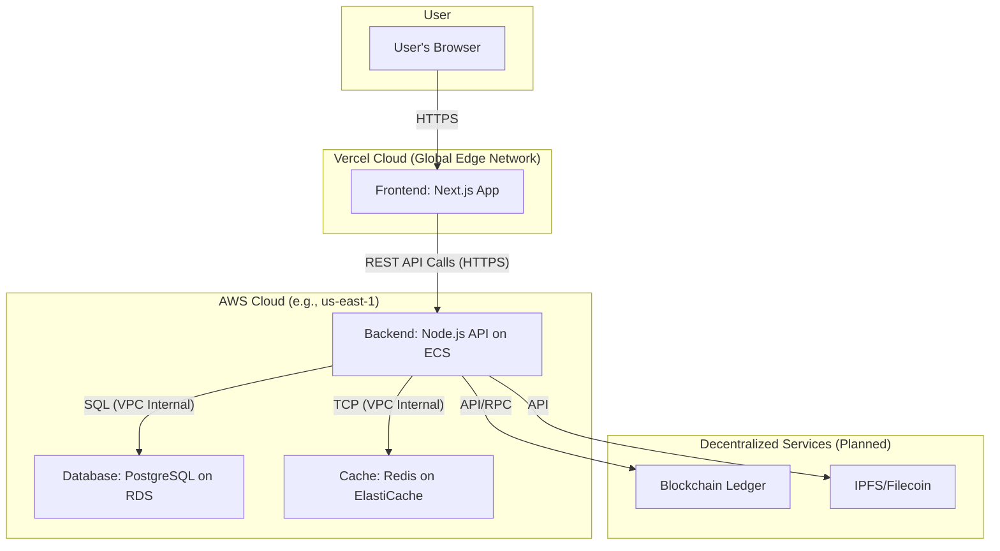
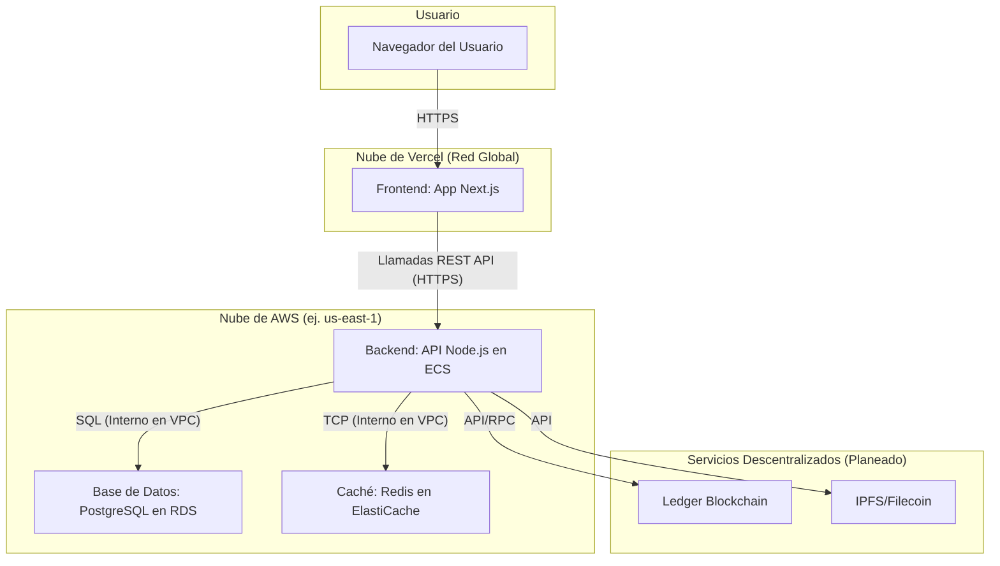

# Doc 4: Ecosystem Architecture & Flows

> **Executive Summary:** This document provides a unified, high-level view of the entire AgroBridge platform architecture. It illustrates our hybrid-cloud strategy, with a Vercel-hosted frontend for global performance and an AWS-hosted backend for scalable, robust computation. The diagram clearly shows the flow of data from the user to our core services and planned decentralized extensions (Blockchain/IPFS), serving as a vital map for all technical and strategic planning.
>
> ---
> **Last Reviewed:** 2025-11-20
> **Document Owner:** Chief Architect

---
## English

### 1. The Big Picture: Our Platform Ecosystem

The AgroBridge platform is designed as a modern, hybrid-cloud ecosystem to be resilient, scalable, and secure.

> **Analogy:** Think of our ecosystem like a modern logistics company. The **Frontend** is the customer portal. The **Backend API** is the central operations hub. The **Database** is the secure filing system. The **Blockchain** is the public notary providing a tamper-proof stamp on every critical shipment.

### 2. End-to-End Architectural Diagram

### 3. Primary Data Flow: Traceability Inquiry

1.  **Request:** A buyer scans a QR code, opening a page on the **Frontend** with a batch ID.
2.  **Process:**
    *   Frontend calls the **Backend API**.
    *   Backend retrieves batch data from the **PostgreSQL Database**.
    *   **(Future)** Backend cross-references data with the **Blockchain Ledger** for a "Verified" status.
3.  **Response:** The Backend returns a complete, verified history of the product's journey, which the Frontend displays to the buyer.

---
## Español

### 1. La Visión General: Nuestro Ecosistema de Plataforma

La plataforma AgroBridge está diseñada como un ecosistema moderno de nube híbrida para ser resiliente, escalable y segura.

> **Analogía:** Piense en nuestro ecosistema como una empresa de logística moderna. El **Frontend** es el portal del cliente. La **API de Backend** es el centro de operaciones. La **Base de Datos** es el sistema de archivo seguro. El **Blockchain** es el notario público que proporciona un sello a prueba de manipulaciones en cada envío crítico.

### 2. Diagrama de Arquitectura End-to-End

### 3. Flujo de Datos Principal: Consulta de Trazabilidad

1.  **Solicitud:** Un comprador escanea un código QR, abriendo una página en el **Frontend** con un ID de lote.
2.  **Proceso:**
    *   El Frontend llama a la **API de Backend**.
    *   El Backend recupera los datos del lote de la **Base de Datos PostgreSQL**.
    *   **(Futuro)** El Backend verifica los datos con el **Ledger Blockchain** para obtener un estado de "Verificado".
3.  **Respuesta:** El Backend devuelve un historial completo y verificado del viaje del producto, que el Frontend muestra al comprador.
