# Process: Innovation & Development Pipeline

> **Audience:** All Teams, Product, Engineering, Investors
> **Objective:** To visualize and define the standard process for taking an idea from conception to production release, providing transparency to all stakeholders.
>
> ---
> **Last Reviewed:** 2025-11-20
> **Document Owner:** Head of Engineering

---
## English

### 1. The Development Lifecycle

Our innovation and development process follows a structured, multi-stage pipeline. This ensures that we experiment quickly, build robustly, and release reliably.

### 2. Visual Pipeline

This diagram shows the flow of work from an idea to a feature used by customers. The live version on the investor dashboard is color-coded to show the status of in-flight projects.

```mermaid
graph TD
    subgraph "Phase 1: Discovery"
        A(💡 Idea Submission) --> B{Triage & Prioritization};
    end

    subgraph "Phase 2: Execution"
        B -- Approved --> C[🔬 Experiment / PoC];
        C -- Validated --> D[💻 Feature Development];
        D --> E[⚙️ QA & Integration];
    end

    subgraph "Phase 3: Delivery"
        E -- Tests Passed --> F[🚀 Production Release];
        F --> G(📈 Monitoring & Feedback);
    end
```

### 3. Stage Gates

To move from one stage to the next, a set of criteria ("stage gates") must be met.

*   **Idea -> Experiment:** Approved by the Innovation Council.
*   **Experiment -> Development:** The Proof of Concept (PoC) validates technical assumptions and shows business value.
*   **Development -> QA:** Feature is code-complete with unit tests and has been peer-reviewed.
*   **QA -> Release:** Passes all E2E tests and UAT in a staging environment. Documentation is updated.
*   **Release -> Monitoring:** Successfully deployed to production and monitored for anomalies.

---
## Español

### 1. El Ciclo de Vida del Desarrollo

Nuestro proceso de innovación y desarrollo sigue un pipeline estructurado de múltiples etapas. Esto asegura que experimentemos rápidamente, construyamos de manera robusta y lancemos de forma fiable.

### 2. Pipeline Visual

Este diagrama muestra el flujo de trabajo desde una idea hasta una característica utilizada por los clientes. La versión en vivo en el dashboard de inversionistas está codificada por colores para mostrar el estado de los proyectos en curso.

```mermaid
graph TD
    subgraph "Fase 1: Descubrimiento"
        A(💡 Envío de Idea) --> B{Evaluación y Priorización};
    end

    subgraph "Fase 2: Ejecución"
        B -- Aprobada --> C[🔬 Experimento / PoC];
        C -- Validada --> D[💻 Desarrollo de Característica];
        D --> E[⚙️ QA e Integración];
    end

    subgraph "Fase 3: Entrega"
        E -- Pruebas Superadas --> F[🚀 Lanzamiento a Producción];
        F --> G(📈 Monitoreo y Feedback);
    end
```

### 3. Criterios de Avance (Stage Gates)

Para pasar de una etapa a la siguiente, se deben cumplir un conjunto de criterios.

*   **Idea -> Experimento:** Aprobada por el Consejo de Innovación.
*   **Experimento -> Desarrollo:** La Prueba de Concepto (PoC) valida los supuestos técnicos y muestra valor de negocio.
*   **Desarrollo -> QA:** La característica está completa a nivel de código con pruebas unitarias y ha sido revisada por pares.
*   **QA -> Lanzamiento:** Pasa todas las pruebas E2E y UAT en un entorno de staging. La documentación está actualizada.
*   **Lanzamiento -> Monitoreo:** Desplegada con éxito en producción y monitoreada en busca de anomalías.