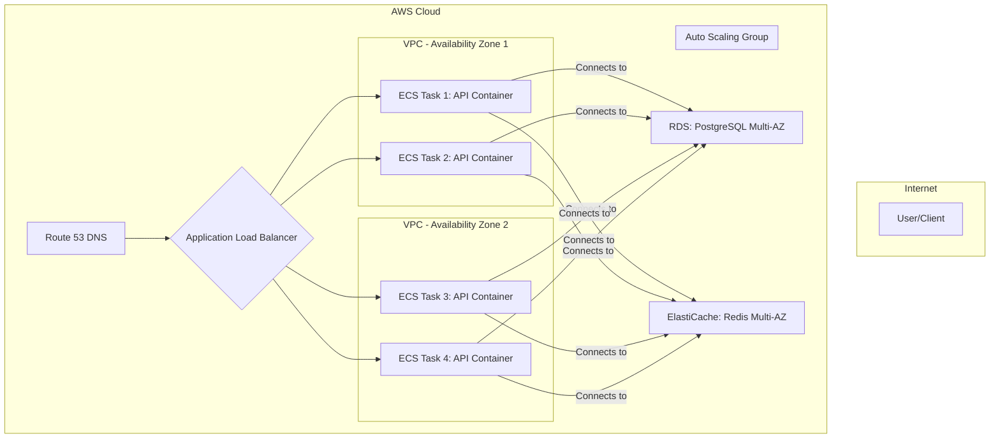
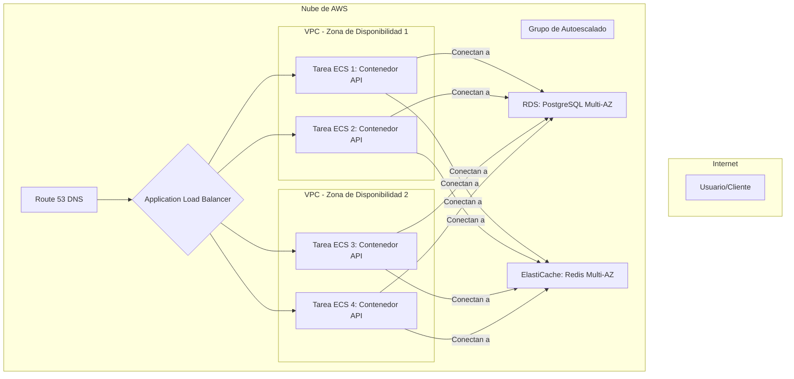

# Doc 6: Scalability & High Availability Policy

> **Audience:** DevOps, SRE, Cloud Architects, Business Leaders
> **Objective:** To outline the strategy for automated scaling and high availability of the AgroBridge API backend, ensuring the platform can handle growth and high-demand scenarios gracefully.

---
## English

### 1. Core Principles for a Scalable System

Our scalability strategy is built on modern cloud-native principles to ensure the platform is both resilient and cost-effective.

*   **Immutability:** Production containers are treated as disposable. We never modify a running container; instead, we deploy a new, updated version to replace it. This ensures predictability.
*   **Statelessness:** The API service itself is "stateless," meaning it doesn't store any session data locally. All state is externalized to the PostgreSQL database (for permanent data) and Redis (for temporary session data). This is the key that allows us to run many identical copies of the API simultaneously.
*   **Automation:** Scaling, deployment, and recovery processes are automated to ensure rapid and reliable responses to changes in traffic.

> **For Non-Technical Stakeholders: An Analogy for Autoscaling**
> Imagine our backend is a supermarket. A single checkout counter is one API container.
> *   If a long line forms (high traffic), we don't ask the cashier to work faster (that's **Vertical Scaling**, and it has limits).
> *   Instead, we automatically open more checkout counters (that's **Horizontal Scaling**).
> *   The **Load Balancer** is the store manager directing new customers to the shortest line.
> *   When the rush is over, we close the extra counters to save on electricity.
> This is how our system "breathes"—expanding and contracting to meet demand perfectly without wasting resources.

### 2. Production Architecture (AWS)

The recommended production architecture on AWS is designed for high availability and elasticity.

*   **Application Load Balancer (ALB):** Distributes incoming traffic across multiple containers in different Availability Zones (AZs).
*   **Amazon ECS (Elastic Container Service):** Manages the lifecycle of our Docker containers.
*   **Auto Scaling Group:** Automatically adjusts the number of running containers based on demand.
*   **Multi-AZ Deployment:** The API, database, and cache are all deployed across multiple physical data centers (AZs). If one data center fails, traffic is automatically rerouted, ensuring zero downtime for our users.

### 3. Autoscaling Policy (Target Tracking)

*   **Scaling Method:** We use a "Target Tracking" policy, which is simpler and more effective than legacy step scaling. We set a target, and AWS does the work to keep our system at that target.
*   **Primary Trigger: CPU Utilization**
    *   **Target:** We will set a target average CPU utilization of **65%**.
    *   **Action:** If the average CPU across all containers rises above 65%, AWS will automatically launch new containers to bring the average down. If it drops significantly below 65%, it will terminate unneeded containers to save costs.

### 4. Comparison to Industry Best Practices

*   **ECS vs. Kubernetes (EKS):** While Kubernetes is the de-facto industry standard for complex microservices, our current architecture is a well-structured monolith. **Amazon ECS** provides the ideal balance of power and simplicity for this stage, reducing operational overhead while still providing robust container orchestration. We retain the option to migrate to EKS in the future if our microservice needs become more complex.
*   **Containers vs. Serverless (Lambda):** Serverless is excellent for event-driven or spiky, short-lived workloads. For a persistent API with steady traffic, a container-based approach offers better performance consistency and avoids cold-start latency issues, providing a smoother user experience.

### 5. FAQ

*   **What is the difference between Horizontal and Vertical Scaling?**
    *   **Vertical Scaling** is like upgrading to a more powerful server (more CPU/RAM). It's expensive and has a hard limit.
    *   **Horizontal Scaling** is adding more individual servers/containers. It's more flexible, resilient, and cost-effective, which is why we've chosen this model.

---
## Español

### 1. Principios Fundamentales para un Sistema Escalable

Nuestra estrategia de escalabilidad se basa en principios modernos nativos de la nube para garantizar que la plataforma sea resiliente y rentable.

*   **Inmutabilidad:** Los contenedores de producción se tratan como artefactos desechables. Nunca modificamos un contenedor en ejecución; en su lugar, desplegamos una nueva versión actualizada para reemplazarlo. Esto garantiza la previsibilidad.
*   **Sin Estado (Statelessness):** El servicio de la API en sí mismo es "sin estado", lo que significa que no almacena datos de sesión localmente. Todo el estado se externaliza a la base de datos PostgreSQL (para datos permanentes) y a Redis (para datos de sesión temporales). Esta es la clave que nos permite ejecutar muchas copias idénticas de la API simultáneamente.
*   **Automatización:** Los procesos de escalado, despliegue y recuperación están automatizados para garantizar respuestas rápidas y fiables a los cambios en el tráfico.

> **Para Stakeholders No Técnicos: Una Analogía para el Autoescalado**
> Imagine que nuestro backend es un supermercado. Una única caja registradora es un contenedor de la API.
> *   Si se forma una larga fila (alto tráfico), no le pedimos al cajero que trabaje más rápido (eso es **Escalado Vertical**, y tiene límites).
> *   En su lugar, abrimos automáticamente más cajas registradoras (eso es **Escalado Horizontal**).
> *   El **Balanceador de Carga** es el gerente de la tienda que dirige a los nuevos clientes a la fila más corta.
> *   Cuando pasa la hora punta, cerramos las cajas extra para ahorrar electricidad.
> Así es como nuestro sistema "respira", expandiéndose y contrayéndose para satisfacer la demanda perfectamente sin desperdiciar recursos.

### 2. Arquitectura de Producción (AWS)

La arquitectura de producción recomendada en AWS está diseñada para alta disponibilidad y elasticidad.

*   **Application Load Balancer (ALB):** Distribuye el tráfico entrante entre múltiples contenedores en diferentes Zonas de Disponibilidad (AZ).
*   **Amazon ECS (Elastic Container Service):** Gestiona el ciclo de vida de nuestros contenedores Docker.
*   **Auto Scaling Group:** Ajusta automáticamente el número de contenedores en ejecución según la demanda.
*   **Despliegue Multi-AZ:** La API, la base de datos y la caché se despliegan en múltiples centros de datos físicos (AZ). Si un centro de datos falla, el tráfico se redirige automáticamente, garantizando cero tiempo de inactividad.

### 3. Política de Autoescalado (Target Tracking)

*   **Método de Escalado:** Usamos una política de "Target Tracking" (seguimiento de objetivo), que es más simple y efectiva. Establecemos un objetivo y AWS se encarga de mantener nuestro sistema en ese objetivo.
*   **Disparador Principal: Uso de CPU**
    *   **Objetivo:** Estableceremos un objetivo de uso medio de CPU del **65%**.
    *   **Acción:** Si el uso medio de CPU supera el 65%, AWS lanzará automáticamente nuevos contenedores. Si cae significativamente por debajo del 65%, terminará los contenedores innecesarios para ahorrar costos.

### 4. Comparación con Mejores Prácticas de la Industria

*   **ECS vs. Kubernetes (EKS):** Mientras que Kubernetes es el estándar de la industria para microservicios complejos, nuestra arquitectura actual es un monolito bien estructurado. **Amazon ECS** proporciona el equilibrio ideal de potencia y simplicidad para esta etapa, reduciendo la sobrecarga operativa. Mantenemos la opción de migrar a EKS en el futuro si nuestras necesidades de microservicios se vuelven más complejas.
*   **Contenedores vs. Serverless (Lambda):** Serverless es excelente para cargas de trabajo event-driven o de corta duración. Para una API persistente con tráfico constante, un enfoque basado en contenedores ofrece un mejor rendimiento y evita problemas de latencia de "arranque en frío", proporcionando una experiencia de usuario más fluida.

### 5. FAQ

*   **¿Cuál es la diferencia entre Escalado Horizontal y Vertical?**
    *   **Escalado Vertical** es como actualizar a un servidor más potente (más CPU/RAM). Es caro y tiene un límite estricto.
    *   **Escalado Horizontal** es añadir más servidores/contenedores individuales. Es más flexible, resiliente y rentable, por lo que hemos elegido este modelo.